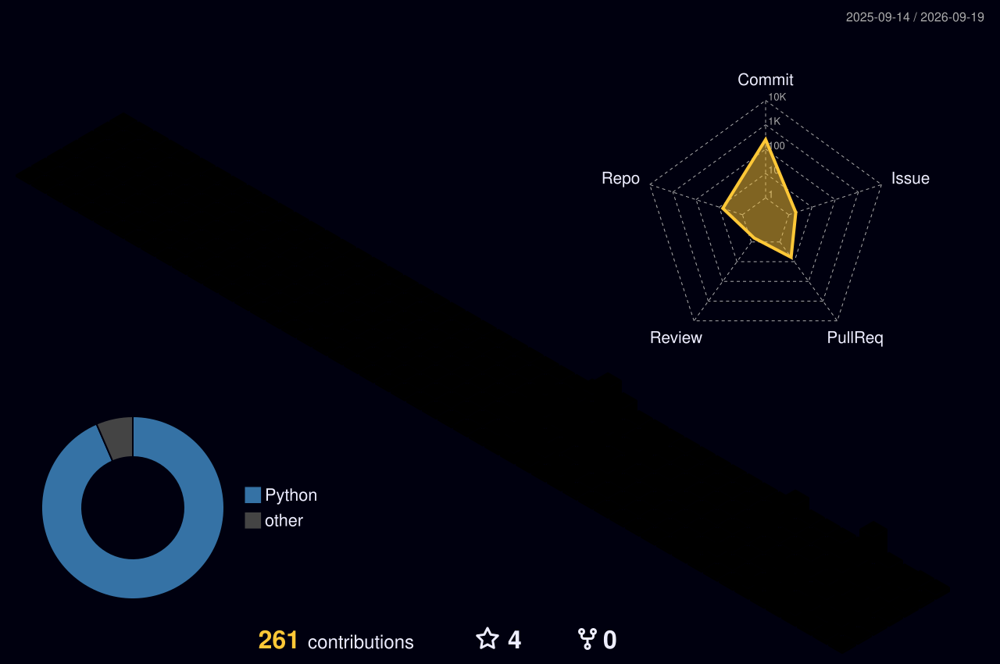

<div align="center">

<!-- ── HEADER ── -->


<!-- ── TYPING ── -->
<a href="https://github.com/Vishwam401/relay">
  
</a>

<br/><br/>


&nbsp;
<a href="https://github.com/Vishwam401?tab=followers"></a>
&nbsp;
<a href="https://leetcode.com/Vishwam1708"></a>

</div>

<br/>

```console
$ relay status --engineer vishwam

  STATE      running
  UPTIME     shipping since 2024
  QUEUE      [1] relay: durable job engine      ← executing
             [2] llm execution layer             pending (month 2)
             [3] scale ceiling measurement       pending (month 4)
  RETRIES    unlimited. backoff: none.
  DLQ        empty — failures get postmortems, not silence
```

---

## 🧑‍💻 About me

<div align="center">
  
</div>

```sql
relay=# SELECT * FROM engineers WHERE username = 'Vishwam401';

-[ RECORD 1 ]----+---------------------------------------------------------------
name             | Vishwam
location         | India 🇮🇳
role             | backend engineer
isolation_level  | SERIALIZABLE          -- one thing at a time, done properly
thesis           | "Using a queue teaches you its API.
                 |  Building one teaches you its guarantees."
portfolio_shape  | wide  → alpha-commerce (40+ endpoints, proves range)
                 | deep  → relay (one system, proves judgment)
strong_at        | {async APIs (FastAPI + asyncpg),
                 |  Postgres internals — MVCC · isolation · row locks,
                 |  payments & webhook security (Razorpay, HMAC-SHA256),
                 |  auth engineering (JWT rotation, Argon2, rate limits),
                 |  background jobs (Celery + RabbitMQ — rebuilding from scratch)}
debug_strategy   | print() first, debugger later 🤫
deadlocks        | 0                     -- I always acquire locks in the same order
last_vacuum      | never                 -- no dead tuples in this career
status           | active ⚡

(1 row)
```

---

## ⚙ What I'm building

<div align="center">
  
</div>

<br/>

### [relay](https://github.com/Vishwam401/relay) — a durable job execution engine, from Postgres primitives

**The contract (this *is* the product):**

| # | Guarantee | Mechanism |
|---|---|---|
| 1 | An accepted job is never lost | commit-before-202, single source of truth |
| 2 | Side effects happen exactly once — even if the worker crashes 5 times | idempotency keys + unique constraints |
| 3 | Failures retry with bounds, not forever | exponential backoff + jitter |
| 4 | Dead jobs go to a DLQ, never silently vanish | max-attempts → dead letter |
| 5 | You can always ask where a job is | `GET /jobs/{id}` |

No Redis. No RabbitMQ. No broker. Just PostgreSQL, `FOR UPDATE SKIP LOCKED`, leases, and a reaper. Every non-obvious choice lands in `DECISIONS.md` as *problem → options → chose → **cost** → rejected because*. If I can't write the cost, I didn't understand the decision.

### [alpha-commerce](https://github.com/Vishwam401/E-commerce) — production-grade e-commerce backend

<div align="center">

<a href="https://www.alpha-commerce.tech/">
  
</a>

<br/>

<a href="https://alpha-commerce.tech">
  
</a>
&nbsp;
<a href="https://github.com/Vishwam401/E-commerce">
  
</a>

</div>

**Key engineering decisions:**
- Dual-token JWT with refresh rotation, theft detection & Redis blacklist
- Atomic stock management with row-level locking
- HMAC-SHA256 webhook verification for Razorpay
- Coupon engine with per-user tracking & race-condition safety
- Celery async invoice delivery with auto-retry · Docker-first, Alembic migrations

---

## 🔬 Things I broke on purpose (and measured)

I don't collect tools — I collect failure modes. Every claim below is measured, not read about:

| Experiment | What actually happened |
|---|---|
| `time.sleep` inside an async endpoint, 3 concurrent requests | **6.04s** vs **2.04s** with `asyncio.sleep` — one blocking call serialized the whole event loop |
| `kill -9` a worker mid-job | No cleanup ran. Job stuck in `running` forever. This single failure is why leases + reapers exist |
| `docker stop` vs `docker kill` on PID 1 | Without a handler, PID 1 never even *receives* SIGTERM — 10s grace, then exit `137` |
| Two transactions, one row, Read Committed | Lost update, **silently** — got `101`, correct answer was `102`. No error. Nothing |
| Write skew: two txns both check a constraint, both pass | Constraint broken anyway. `REPEATABLE READ` doesn't stop it. `SERIALIZABLE` does — by throwing `40001` at you |
| Connection pool capped at 2, 10 concurrent requests | Looks exactly like "the DB is slow." The DB was fine. The queue-wait hides inside your latency |
| Connect timeout vs read timeout | `connect` fail = request never arrived → retry is safe. `read` fail = **unknowable** → retry may double a side effect |

These aren't bugs I hit — they're bugs I *scheduled*. The failure matrix is the syllabus.

---

## 🧰 Stack

<div align="center">

**languages**
<br/>


**backend**
<br/>


**data**
<br/>


**infra & tools**
<br/>


</div>

```text
orm/migrations   sqlalchemy 2.0 · alembic · pydantic
testing          pytest · hypothesis — "after any crash sequence, side-effect count == 1"
reading          designing data-intensive applications · kurose ch.3 · production postmortems
```

---

## 📐 How I learn

```
for every dependency:
    what does it guarantee — and what does it NOT?
    if it dies, does my system degrade or die with it?
    what happens if this work executes twice?
    if state lives in two places, who keeps them honest?
    under load, what breaks first?
```

- **Weekly postmortem ritual** — reading other people's incidents (Cloudflare, Buttondown, incident.io) as a substitute for on-call scars
- **Plan and log are never the same file** — the plan states intent, the log states measured outcome
- **Measured vs inferred** — every claim in my logs is labeled. "Likely" is not "confirmed"

---

## 📊 Numbers

<div align="center">


&nbsp;


<br/><br/>


<br/><br/>

<a href="https://leetcode.com/u/Vishwam1708/">
  
</a>

</div>

---

## 🌌 Contribution topology

<div align="center">

<!-- 3D contribution graph (generated by your profile-3d-contrib workflow — verify the exact SVG filename in that folder) -->


<!-- Snake (generated by snake.yml — paths from your previous README's output branch) -->
<picture>
  <source media="(prefers-color-scheme: dark)" srcset="https://raw.githubusercontent.com/Vishwam401/Vishwam401/output/github-snake-dark.svg"/>
  <source media="(prefers-color-scheme: light)" srcset="https://raw.githubusercontent.com/Vishwam401/Vishwam401/output/github-snake.svg"/>
  
</picture>

<br/><br/>


</div>

---

## 📬 Let's connect

<div align="center">

```console
$ relay enqueue --type "collaboration" --payload "your idea here"
→ 202 Accepted  { "status": "pending", "response_sla": "fast" }
```

<a href="mailto:vishwam.connects@gmail.com">
  
</a>
&nbsp;
<a href="https://www.linkedin.com/in/vishwam-vaghasiya/">
  
</a>
&nbsp;
<a href="https://leetcode.com/u/Vishwam1708/">
  
</a>
&nbsp;
<a href="https://github.com/Vishwam401/relay">
  
</a>

<br/><br/>


</div>
